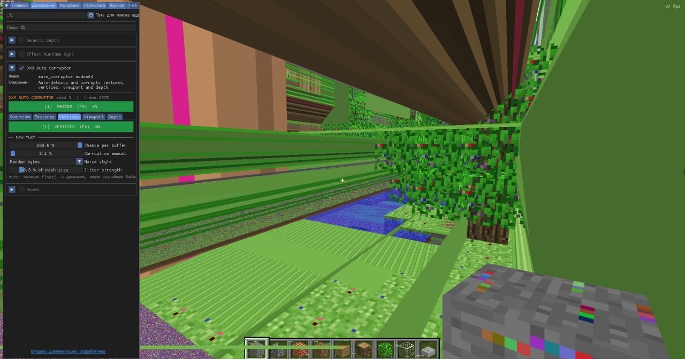

# Vertex Corruptor

A simple **ReShade vertex corruptor** addon.

## Installation

Just put the `.addon64` file into the same folder as the ReShade DLL:

```text
Game/
├── opengl32.dll
└── VertexCorruptor.addon64
```

or:

```text
Game/
├── d3d11.dll
└── VertexCorruptor.addon64
```

The `.addon64` file should **not** be placed in the `reshade-shaders` folder.

Launch the game and ReShade will load the addon automatically.

## Usage

No additional installation or configuration is required.

## Interface




